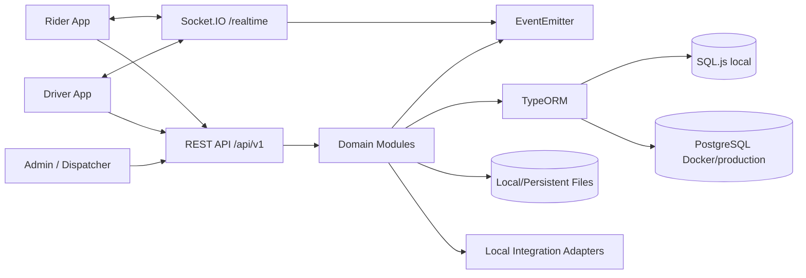

# Architecture

## System shape

EVzone Ride is a modular NestJS application with a shared relational data model and event-driven real-time updates.



## Module boundaries

- `auth`: account creation, login, refresh tokens, OTP and password operations.
- `users`: personal profile, addresses, contacts and preferences.
- `drivers`: driver profile, documents, presence, location, sessions, goals and training.
- `vehicles`: fleet, documents, accessories and active vehicle assignment.
- `pricing`: common quote engine, service rules, extras, promo codes and surge.
- `rides`: ride-hailing aggregate and driver matching.
- `deliveries`: parcel logistics aggregate and tracking.
- `tourist`: tourism catalogue and bookings.
- `ambulance`: facility lookup, medical transport and dispatch.
- `rentals`: vehicle availability and rental lifecycle.
- `wallets` / `payments`: financial ledger and payment orchestration.
- `chat`, `notifications`, `realtime`: communication and event delivery.
- `safety`: emergency response, trip sharing, proof, map reports and support.
- `admin`: fleet/user compliance and operational reporting.

Each domain owns its controller, validation DTOs and service. Shared persistence entities are registered globally by `DatabaseModule`.

## Persistence model

The project contains 115 TypeORM entities. Important aggregate roots are:

- `User`, `DriverProfile`, `Vehicle`.
- `Ride` with `RideStop`, `RideOffer`, `RidePassenger`, `RideEvent`, `RideFeedback`.
- `DeliveryOrder` with `DeliveryItem`, `DeliveryStop`, `DeliveryEvent`, `TrackingInvitation`.
- `TouristBooking` and `TourPackage`.
- `AmbulanceRequest`, `MedicalFacility`, `AmbulanceEvent`.
- `RentalBooking`, `RentalInspection`, `RentalBlock`.
- `Wallet`, `WalletTransaction`, `Payment`, `Payout`.
- `EmergencyIncident`, `TripShare`, `MapReport`, `SupportTicket`.

All primary keys are UUIDs. Mutating requests produce audit records. Booking histories use explicit event tables rather than relying only on the current status column.

## Booking state management

State transitions are validated in domain services. A representative ride flow is:

```text
REQUESTED/SEARCHING -> OFFERED -> DRIVER_EN_ROUTE -> ARRIVED -> WAITING
-> VERIFIED -> IN_PROGRESS -> COMPLETED
```

Cancellation, rejection, timeout and no-show are terminal alternatives. Delivery, rental, ambulance and tourist services have their own constrained lifecycles.

## Driver matching

1. A request stores route coordinates and obtains a price quote.
2. The matching service finds verified, online drivers with the required service capability.
3. Haversine distance filters drivers by the configured radius.
4. The active vehicle is checked for status and service eligibility.
5. Up to five expiring offers are stored and pushed to user-specific Socket.IO rooms.
6. The first valid acceptance atomically assigns the driver/vehicle and expires remaining offers.
7. Scheduled jobs retry unmatched rides and activate scheduled rides near departure time.

## Real-time design

The gateway authenticates Socket.IO clients with a JWT. It uses two room types:

- `user:<userId>` for offers, notifications, chat and private service changes.
- `service:<serviceType>:<serviceId>` for authorized live tracking screens.

Domain services emit internal events after state changes. The gateway maps these events to Socket.IO messages, keeping HTTP lifecycle logic independent from transport details.

## Financial model

- Every service stores estimated and final monetary values plus payment status.
- Payment creation uses an idempotency key.
- Wallet operations use an immutable transaction ledger and store `balanceAfter`.
- Provider earnings are credited after successful service payment.
- The default platform/provider split is implemented in `PaymentsService`.
- Refunds credit the customer wallet and update the payment state.
- The included local provider makes all flows executable without external credentials.

## Security controls

- JWT bearer authentication and role guards.
- Opaque refresh tokens stored only as SHA-256 hashes.
- Passwords hashed with bcrypt.
- OTP and ride verification codes stored as hashes.
- Request DTO whitelist and rejection of unknown properties.
- Helmet headers, CORS and rate limiting.
- Access checks on every booking aggregate.
- State-machine validation for privileged actions.
- Audit interception for POST, PUT, PATCH and DELETE requests.
- Private fields use TypeORM `select: false`.

## Local and production modes

### Local

- SQL.js with an auto-saved database file.
- Automatic schema synchronization.
- Demo seed data.
- Local payment, OTP, notification and file adapters.

### Docker/production-shaped

- PostgreSQL.
- Persistent upload volume.
- Multi-stage non-root image.
- Health checks and restart policies.

The domain modules do not depend directly on a specific payment, map, SMS or push vendor. Those boundaries can be swapped for production adapters while preserving controllers and data contracts.

## Version 2 operational platforms

The application remains a modular monolith so all service domains use one transactionally consistent data model. The following modules extend—not replace—the original domains:

- `organizations`: tenant boundary and membership authorization.
- `fleet-partners`: fleet assets, assignments, maintenance, compliance and School App synchronization.
- `dispatch`: dispatch desks, agent permissions, shifts, manual booking envelope and service provisioning.
- `corporate-pay`: external payment-provider adapter, webhooks, reconciliation and outbox.
- `admin`: unified oversight for the original and expanded domains.

A manual booking always creates or references the canonical underlying domain record. This avoids parallel ride/delivery state machines and preserves compatibility with Rider and Driver applications.

External calls use an outbox-compatible design. CorporatePay callbacks and School callbacks are deduplicated or checksum-versioned, and integration credentials are encrypted at rest using AES-256-GCM.

## Version 3 hardening and compatibility

Version 3 adds the following shared layers without duplicating the domain aggregates:

- `idempotency`: a global interceptor stores request scope, authenticated user, request hash, completion state and replayable response.
- `compatibility`: machine-readable contracts and canonical aliases delegate to the existing Rider, Driver, Fleet, Dispatcher and Admin services.
- `onboarding`: reusable application/checklist/document review records for drivers and business partners.
- `governance`: feature flags, maker/checker approvals, risk cases, service configuration and operational alerts.
- `operations`: configurable watchdogs for stale driver heartbeats, unmatched ride requests, expired compliance documents and stuck active services.
- `financial-operations`: encrypted stored payment methods and reviewed cashout requests on top of the original wallet ledger.
- `commutes`: reusable Rider route/schedule definitions that create normal canonical Ride records when booked.
- `geolocation`: provider-backed places/routes plus local geofence and deterministic route fallback.

The version 6 schema registers 115 TypeORM entities, including Fleet Portal branches, resources, configuration, custom roles and member invitations. Optional Redis Socket.IO scaling is isolated in `RedisIoAdapter`; when disabled or unavailable, the original in-process adapter is used.


## Version 4 report-driven infrastructure

Version 4 adds resilient infrastructure around the existing aggregates rather than replacing them:

- `matching`: persistent dispatch jobs and expiring offers. Radius expansion and redispatch survive process restarts, while manual route assignment cancels outstanding offers.
- `geolocation`: PostGIS-first proximity in PostgreSQL, Redis GEO fallback and Haversine fallback for SQL.js or degraded environments.
- `delivery-routes`: multiple delivery orders are grouped into ordered pickup/drop-off stops with QR and OTP verification.
- `accounting`: double-entry journal lines, balanced transaction groups, trial-balance reporting and driver earnings entries.
- `infrastructure`: Kafka publishing with a durable outbox and console fallback, Redis health/fallback state and provider status.
- `files`: Cloudinary primary storage when configured, with local persistent storage as a plug-and-play fallback.
- `notifications`: persisted device tokens and Firebase-compatible push delivery with local fallback.
- `realtime`: JWT-authenticated `/driver`, `/rider` and `/admin` namespaces plus the retained `/realtime` compatibility gateway.
- `auth`: OTP password recovery and short-lived reset tokens in addition to the existing access/refresh token flow.

The accounting, matching and event records use the same relational transaction boundary as the domain services. External Kafka, Redis, Cloudinary and Firebase services are optional; their absence is explicit in status endpoints and does not prevent local operation.


## Version 5 mobile contract layer

Version 5 adds app-facing orchestration around the existing aggregates:

- `mobile`: capability negotiation, public configuration, authenticated state bootstrap and device aliases.
- `places`: Rider recent and pinned location history alongside the retained address book.
- `driver-jobs`: normalized offers across all six service types with atomic acceptance semantics.
- `driver-experience`: service preferences, learning, assessments and verifiable certificates.
- `reviews`: generic cross-service ratings, responses, reports and moderation.
- `rental-catalog`: branches, vehicle classes and custom quotation requests.

These modules reuse the existing authentication, validation, role authorization, notifications, domain events and persistence infrastructure. Legacy compatibility endpoints remain mounted separately to avoid route ambiguity.
