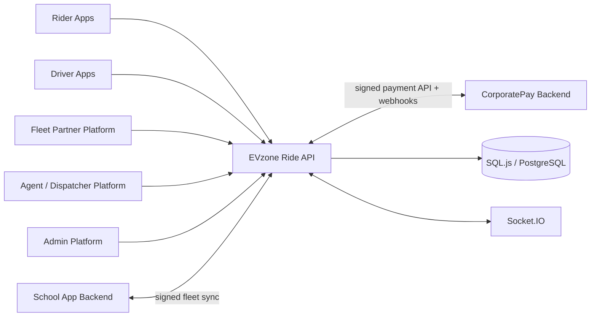

# EVzone Ride Platform Expansion

Version 2.0 keeps every original Rider, Driver and five-service domain capability and adds three first-class platforms plus the CorporatePay boundary.

## Platform topology

CorporatePay and the School App remain separate systems. Their integration records, credentials, callbacks, retries and reconciliation states are managed in this backend.

## Organizations and tenancy

`Organization` is the tenancy boundary for fleet and dispatch operations. An organization has one primary owner and any number of members with roles such as owner, administrator, fleet manager, dispatch manager, dispatcher, agent, finance, compliance and viewer.

Important guarantees:

- Every fleet, dispatch desk, agent profile and CorporatePay organization account belongs to an organization.
- Service methods verify active organization membership before reading or mutating tenant data.
- Management operations require an owner/admin or the corresponding operational role.
- Global administrators can review organizations and inspect all tenants.

## Fleet Partner

A `FleetProfile` supports these capabilities independently or together:

- `RIDE`
- `DELIVERY`
- `TOURIST_VEHICLE`
- `AMBULANCE`
- `CAR_RENTAL`
- `SCHOOL_SHUTTLE`

Fleet Partner records cover:

- Vehicles and drivers linked to a fleet without changing their original EVzone records.
- Ownership/engagement type, activation status, external IDs, service capabilities and school-management metadata.
- Driver/vehicle assignments, time windows, linked service records and external school routes.
- Maintenance schedules, odometer, cost, service provider, attachments and completion.
- Compliance views for inactive vehicles, unverified drivers and overdue maintenance.
- A consolidated dashboard for assets, assignments, active service jobs, school connectivity and paid volume.

### School App synchronization

A school connection stores encrypted integration credentials and synchronization configuration. Supported modes are inbound, outbound and bidirectional.

Resources are mirrored using an idempotent key of connection, resource type and external ID. Each mirror stores its payload, checksum, version, local entity link and last synchronization time. Sync jobs record correlation ID, direction, processed/failed counts, status and errors.

When `baseUrl` is empty, the adapter runs in local sandbox mode. A configured remote connection uses:

- `GET {baseUrl}/health`
- `GET {baseUrl}/api/fleet/resources`
- `POST {baseUrl}/api/fleet/resources/sync`
- HMAC-signed inbound webhook at `/api/v1/fleet-partners/school/webhooks/:connectionId`

## Agent and Dispatcher

A dispatch organization can have multiple desks. Each desk carries timezone, service capabilities, operating zones and settings. Agent profiles define whether a user may create manual bookings, assign assets, override pricing or issue refunds.

Manual booking behavior:

1. Resolve an existing customer by ID, phone or email, or create a shadow customer account.
2. Validate the service-specific payload with the original domain DTO.
3. Create the real underlying Ride, Delivery, Tourist Booking, Ambulance Request or Rental Booking.
4. Store the manual booking envelope and immutable event timeline.
5. Optionally initiate CorporatePay.
6. Optionally assign a compatible driver/vehicle from a fleet.
7. Notify the customer and driver and emit real-time updates.

School-shuttle manual bookings refer to the School backend's external trip ID while still participating in dispatch, fleet assignment and CorporatePay orchestration.

## CorporatePay boundary

CorporatePay is not implemented as an internal wallet. It is integrated as a separate payment provider.

The adapter provides:

- User- or organization-level account links.
- Transaction and monthly limits.
- Idempotent payment initiation linked to the EVzone `Payment` record and service record.
- Local sandbox or remote REST mode.
- HMAC request signing and webhook signature verification.
- Webhook event deduplication.
- State synchronization for approval, payment, decline, failure and refund.
- Settlement reconciliation and variance resolution.
- Retryable integration outbox for temporary remote failures.

Sandbox mode is enabled by default and can auto-settle transactions, allowing all platform workflows to run without a CorporatePay deployment. Remote mode is enabled by setting `CORPORATEPAY_MODE=remote`, `CORPORATEPAY_BASE_URL` and credentials.

## Admin platform

The Admin API retains the original user, driver, document, vehicle and audit controls and adds:

- Organization listing and approval/rejection/suspension.
- User role management.
- Fleet inspection and fleet status review.
- Manual-booking inspection across organizations.
- CorporatePay transaction oversight.
- School connection and integration-outbox health.
- Dispatch desk and agent counts.
- Protected and unprotected platform settings.
- Expanded dashboard counts and payment volume.

## Demo topology

A fresh local database seeds one approved demonstration organization containing:

- Six service-capable vehicles, including an electric school bus.
- Five drivers, including a school-shuttle driver.
- One active Fleet Partner profile.
- One dispatch desk, one dispatcher and one agent.
- One CorporatePay sandbox account.
- One local School App connection.

See the root README for login credentials.
